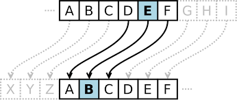

<h1>Encryption</h1>

Dating back thousands of years, encryption has played a pivotal role in safeguarding sensitive information. From ancient ciphers like the Caesar cipher to modern-day encryption standards such as AES, the evolution of encryption reflects humanity's ongoing quest for privacy and security in communication. Through the centuries, encryption has been utilized by governments, militaries, and individuals alike, shaping the course of history and revolutionizing the way we protect our digital assets. 

<h2>Project</h2>
My encryption project leverages cutting-edge cryptographic techniques to ensure the confidentiality and integrity of sensitive data. Through innovative algorithms and rigorous testing, I'm dedicated to providing robust encryption solutions that protect against unauthorized access and maintain privacy in an ever-evolving digital landscape. 
