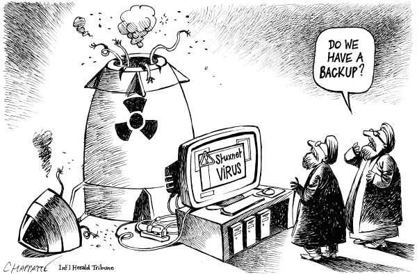

<h1>Brief history about cybersecurity...</h1>

In the annals of cybersecurity history, pivotal attacks have left indelible marks on the digital landscape. The LoveLetter attack, also known as the ILOVEYOU <b>virus</b>, spread rapidly in 2000 via email attachments posing as love letters. It caused widespread damage by overwriting files and infecting millions of computers globally, highlighting the vulnerability of users to social engineering tactics.

---

Following suit, Stuxnet's emergence in 2010 unveiled the era of state-sponsored cyber warfare, targeting industrial control systems. The Stuxnet attack was a highly sophisticated cyber weapon designed to sabotage Iran's nuclear program. It exploited <b>zero-day vulnerabilities</b> in Windows systems and targeted Siemens industrial control systems, specifically centrifuges used for uranium enrichment. Stuxnet's unprecedented level of complexity and precision marked a new era in state-sponsored cyber warfare, demonstrating the potential for <b>malware</b> to inflict physical damage on critical infrastructure. Its discovery sparked widespread concern over the vulnerability of industrial systems to cyber attacks and prompted heightened vigilance in cybersecurity efforts worldwide.

---

Furthermore, the WannaCry ransomware attack in 2017 caused global chaos. The WannaCry attack was a global <b>ransomware</b> outbreak that exploited vulnerabilities in Windows systems. It propagated rapidly across networks, encrypting files and demanding ransom payments in Bitcoin. Its impact was widespread, affecting hundreds of thousands of computers in over 150 countries, including critical infrastructure and healthcare systems. The WannaCry attack underscored the importance of timely patching and robust cybersecurity measures to mitigate the risk of ransomware threats. 

---

More recently, the SolarWinds <b>supply chain attack</b> of 2020 shook the cybersecurity world, infiltrating software updates to compromise thousands of organizations' networks. These attacks serve as stark reminders of the ever-evolving cyber threat landscape, driving continuous innovation and resilience in cybersecurity defenses. 

<h2>My Cybersecurity Portfolio!</h2>
With a diverse range of projects spanning network security, cryptography, and <b>ethical hacking</b>, my cybersecurity portfolio showcases my expertise in safeguarding digital assets. From developing secure authentication protocols to conducting penetration tests, each project demonstrates my commitment to mitigating cyber threats and protecting sensitive information. With a focus on innovation and continuous learning, I strive to stay ahead of emerging threats and contribute to a safer digital environment.  
<h3>Explore my portfolio to see how I'm addressing cybersecurity challenges and building resilient defenses in today's interconnected world.</h3>
<ul>
  <li> <a href="https://github.com/pedroandre1712/mystudies/edit/main/cyber_security/encryption/">Encryption</a></li>
  <li> <a href="https://github.com/pedroandre1712/mystudies/edit/main/cyber_security/keylogger/">Keylogger</a></li>
</ul>
